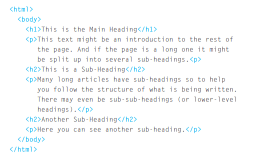
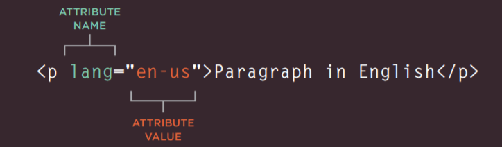
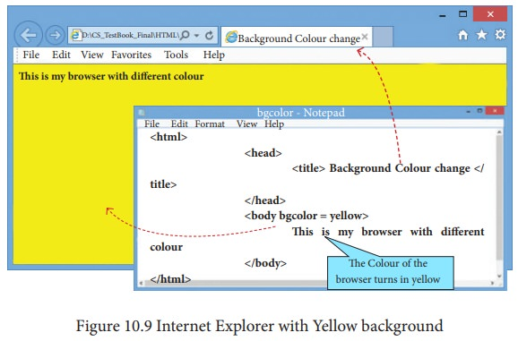
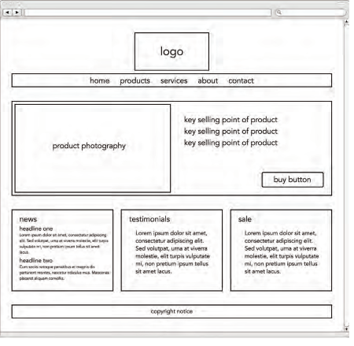

# Html Structure

## **HTML:** The HTML is used to create web pages.we add tags or elements to the contents so that the browser knows what is a heading, where a paragraph begins and ends, and so on. 

The HTML code **(in blue)** is made up of characters that live inside angled brackets — these are called HTML elements. Elements are usually made up of two tags: an opening tag and a closing tag. (The closing tag has an extra forward slash in it.) Each HTML element tells the browser something about the information that sits between its opening and closing tags.
## **Attributes**
Attributes Tell Us More About Elements. Attributes provide additional information about the contents of an element.
They appear on the opening tag of the element and are made up of two parts: a name and a value, separated by an equals sign.
The attribute name indicates what kind of extra information you are supplying about the element's content. 
It should be written in lowercase.
The value is the information or setting for the attribute. It should be placed in double quotes. Different attributes can have different values.
Here an attribute called **lang** is used to indicate the language used in this element. The value of this attribute on this page specifies it is in US English.

## **Body, Head & Title**
1. **< body >** Everything inside this element is shown inside the main browser window.
2. **< Head >** This contains information about the page.
3. **< title >** The contents of the < title > element are either shown in the top of the browser, above where you usually type in the URL of the page you want to visit, or on the tab for that page (if your browser uses tabs to allow you to view multiple pages at the same time).

-------------------------

-------------------------

-------------------------
# website layout : 
- A website layout is a pattern (or framework) that defines a website’s structure. It has the role of structuring the information present on a site both for the website’s owner and for users. It provides clear paths for navigation within webpages and puts the most important elements of a website front and center.

- Website layouts define the content hierarchy. Content will guide visitors around the website, and it must convey your message as well as possible to them. 

### To make the best layout ,we need to check these points :

* Every website should be designed for the target audience not just for yourself or the site owner. It is therefore very important to understand who your target audience is.
* We need to know why they will visit the web site and what they are trying to achieve.
* We need to know how often visitors will visit the website.
* And to make the site more useful we need to add the ((Site Map)).

## wireframe

After all of that ,we will know what needs to appear on the website , so we need to draw the website with ((WireFrames))
which is a simple sketch of the key information that needs to go on each page of a site. It shows the hierarchy of the information and how much space it might require. wireframe usually contains header,main and footer.

