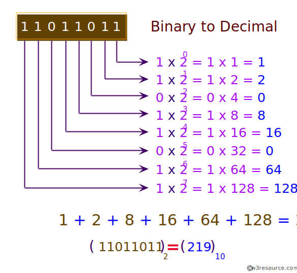
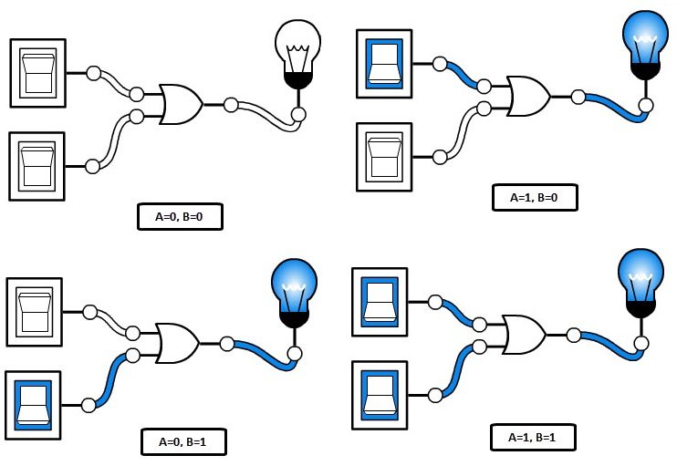
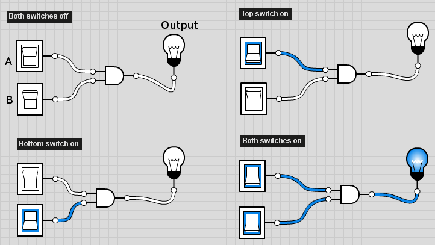
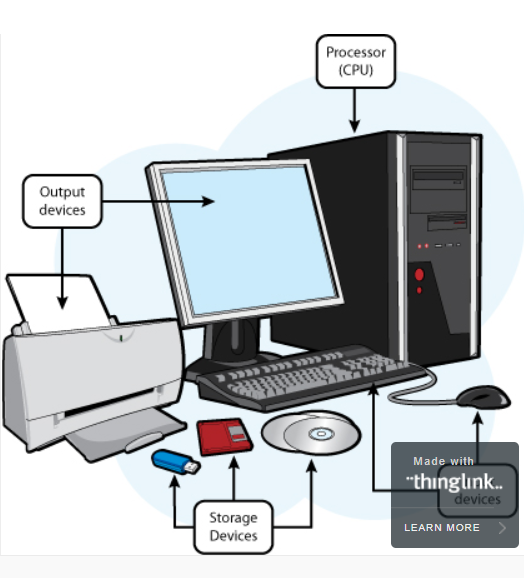

# How Computers Work

## What Makes a Computer, a Computer?  

All computers should work the same through four steps:
1. Input
2. Storage
4. Processing Information
4. Output  

If the device dose all  the 4 steps , then it is a **COMPUTER!**

## Binary & Data
Binary (or base-2) is  a numeric system that only uses two digits ( **0** and **1** ). Computers operate in binary, meaning they store data and perform calculations using only **zeros** and **ones**.

A single binary digit can only represent True (1) or False (0) in boolean logic. However, multiple binary digits can be used to represent large numbers and perform complex functions. 
In fact, any integer can be represented in binary.

One **bit** contains a single binary value — either a 0 or a 1.
A **byte** contains eight **bits**, which means it can have 256 different values.
These values may be used to represent different characters in a text document, the RGB values of a pixel within an image file, or many other types of data.

#  

## Circuits and Logic
A logic circuit is a circuit that executes a processing or controlling function in a computer.  This circuit implements logical operations on information to process it.

Logic circuits utilise two values for a given physical quantity (voltage, for example) to denote the Boolean values true and false or 1 and 0 respectively.  Logic circuits have inputs, as well as having outputs which can be dependent on the inputs.
In logic circuit diagrams, connection from one circuit’s output to another circuit’s input is displayed as an arrowhead at the input end.

# 

## CPU, Memory, Input & Output
* The computers get inputs information,
* Store and process the information,
* And then, output information.

Each step is done by a different part of the computer.
* There are input devices that convert inputs into binary information.
* There is memory to store this information. There's a central processing unit ((CPU))
* There are output devices that take information and convert it into a physical output.

# 

## Hardware and Software
* **software** refers to the programs that can be run on the computers.
* **Hardware** is the physical parts of a computer, such as the processor, memory modules and the screen. 

Hardware and Software work hand in hand whenever any operation on a computer is running.

# 
