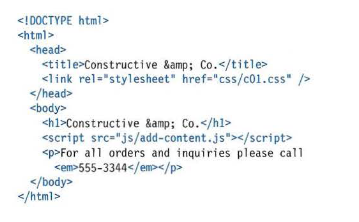
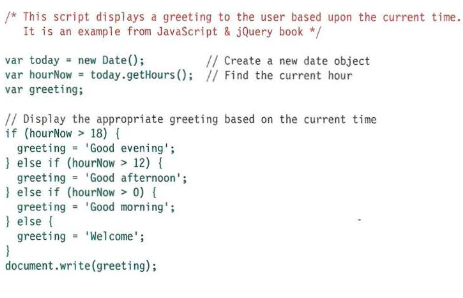
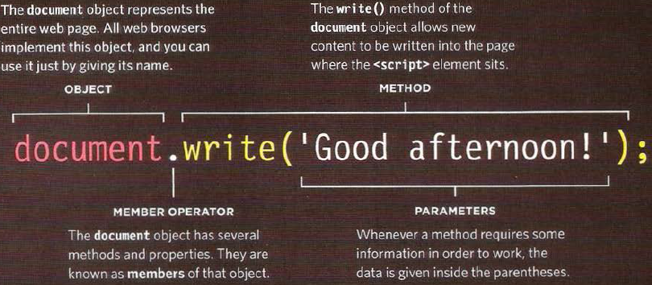

# Dynamic web pages with JavaScript

**JavaScriptis** a programming language mostly used client-side to make webpages interactive. You can create amazing webpages without JavaScript, but JavaScript opens up a whole new level of possibilities.

## How to trigger JavaScript from HTML
Within a browser, JavaScript doesn't do anything by itself. You run JavaScript from inside your HTML webpages. To call JavaScript code from within HTML, you need the `<script>` element. There are two ways to use script, depending on whether you're linking to an external script or embedding a script right in your webpage.

If you view the source code of the page in the browser, the JavaScript will not have changed the HTML, because the script works with the model of the web page that the browser has created.

====

#### **You should write comments to explain what your code does. They help make your code easier to read and understand. This can help you and others who read your code.**

We write multi comments by putting oue whole text between these signs /* text */ and to write a single comment we put // before the comment

 
===

#### **JS Objects**

Objects are a very important entity in **JS** and Objects contains **Methods**, another important tool in JS

====

#### **JS variables**

we can define variables in **JS** using ( `var a = value`). variables can be changed and modified or left without a value.
there are three type of data for variables values  :

1. **String**
2. **Number**
3. **Boolean** ( true or false )

