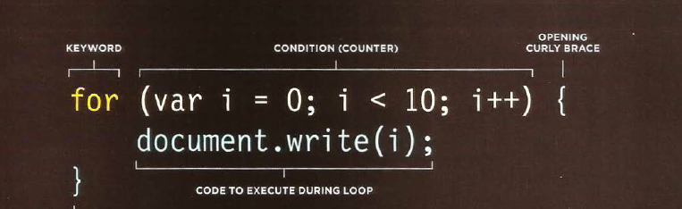
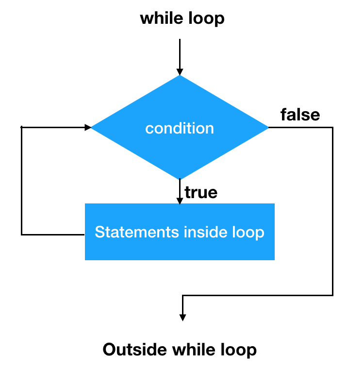
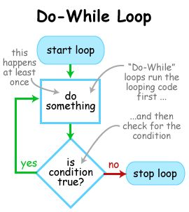

# JS Loops

**Loops** are used in **JavaScript** to perform repeated tasks based on a condition. Conditions typically return **true** or **false** when analysed. 
A loop will continue running until the defined condition returns **false**.

**The three most common types of loops are:**

1. **for**
2. **while**
3. **do while**

---------

## **For Loop**

**Syntax:**

`for ([initialization]); [condition]; [final-expression]) {`
   `// statement`
`}`

The javascript for statement consists of three expressions and a statement:

* **initialization** - Run before the first execution on the loop. This expression is commonly used to create counters. 
* **Variables**  created here are scoped to the loop. Once the loop has finished it’s execution they are destroyed.
* **condition** - Expression that is checked prior to the execution of every iteration. If omitted, this expression evaluates to true. If it evaluates to true, the loop’s statement is executed. If it evaluates to false, the loop stops.
* **final-expression** - Expression that is run after every iteration. Usually used to increment a counter. But it can be used to decrement a counter too.
* **statement** - Code to be repeated in the loop

---------

## **While Loop**

The while loop starts by evaluating the condition. If the condition is **true**, the statement(s) is/are executed. If the condition is **false**, the statement(s) is/are not executed. After that, while loop **ends**.

**Syntax**:

`while (condition)`

`{`

`  statement(s);`

`}`

**statement**(s): A statement that is executed as long as the condition evaluates to true.

**condition**: Here, condition is a Boolean expression which is evaluated before each pass through the loop.

If this condition evaluates to **true**, statement(s) is/are executed.

When condition evaluates to **false**, execution continues with the statement after the while loop.

----------

## **Do...While Loop**

The **do...while loop** is closely related to while loop. In the do while loop, the condition is checked at the end of the loop.

**Syntax**:

 `do {`

   `*Statement(s);*`

`} while (*condition*);`

* **statement**(s): A statement that is executed at least once before the condition or Boolean expression is evaluated and is re-executed each time the condition evaluates to true.

* **condition**: Here, a condition is a Boolean expression. If Boolean expression evaluates to true, the statement is executed again. When Boolean expression evaluates to false, the loops ends.